ggplot: The basics
================
Jonas Schöley
June 18th, 2017

-   [First steps: data, layers and aesthetics](#first-steps-data-layers-and-aesthetics)
-   [Scales (versus aesthetics)](#scales-versus-aesthetics)
    -   [Scale transformations](#scale-transformations)
    -   [Scale breaks and labels](#scale-breaks-and-labels)
    -   [Sidenote: levels and order in ggplot](#sidenote-levels-and-order-in-ggplot)
    -   [Scale limits](#scale-limits)
    -   [Sidenote: Limiting versus zooming](#sidenote-limiting-versus-zooming)
-   [A makeover...](#a-makeover...)
-   [Further Reading](#further-reading)

First steps: data, layers and aesthetics
----------------------------------------

Interactive plots displayed in a web-browser are all the rage nowadays with [Gapminder World](http://www.gapminder.org/world) being a true classic of the genre.

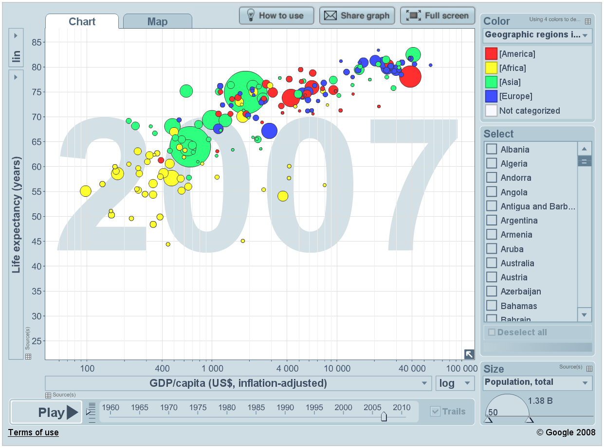

Today we shall recreate the above chart and in doing so learn the basics of ggplot. Key concepts we will tackle are *aesthetics*, *layers*, *scales*, and *facets*. The command `library(tidyverse)` loads ggplot plus other packages for reading data, transforming data and reshaping data. Look [here](http://tidyverse.org/) for more information on the tidyverse -- a collection of packages with a common design philosophy.

``` r
library(tidyverse)
```

    ## Loading tidyverse: ggplot2
    ## Loading tidyverse: tibble
    ## Loading tidyverse: tidyr
    ## Loading tidyverse: readr
    ## Loading tidyverse: purrr
    ## Loading tidyverse: dplyr

    ## Conflicts with tidy packages ----------------------------------------------

    ## filter(): dplyr, stats
    ## lag():    dplyr, stats

Each ggplot starts with *data*. **Data must be a data frame**! Today we will use data which comes in form of an R package: The gapminder data.

``` r
library(gapminder)
is.data.frame(gapminder)
```

    ## [1] TRUE

``` r
head(gapminder)
```

    ## # A tibble: 6 x 6
    ##       country continent  year lifeExp      pop gdpPercap
    ##        <fctr>    <fctr> <int>   <dbl>    <int>     <dbl>
    ## 1 Afghanistan      Asia  1952  28.801  8425333  779.4453
    ## 2 Afghanistan      Asia  1957  30.332  9240934  820.8530
    ## 3 Afghanistan      Asia  1962  31.997 10267083  853.1007
    ## 4 Afghanistan      Asia  1967  34.020 11537966  836.1971
    ## 5 Afghanistan      Asia  1972  36.088 13079460  739.9811
    ## 6 Afghanistan      Asia  1977  38.438 14880372  786.1134

First step in plotting with ggplot: provide ggplot with a data frame:

``` r
ggplot(data = gapminder)
```


ggplot knows about our data but nothing happens yet. We need to add a *layer*. **We add elements to a plot by adding them with a `+`.**

``` r
ggplot(data = gapminder) +
  geom_line(aes(x = year, y = lifeExp))
```

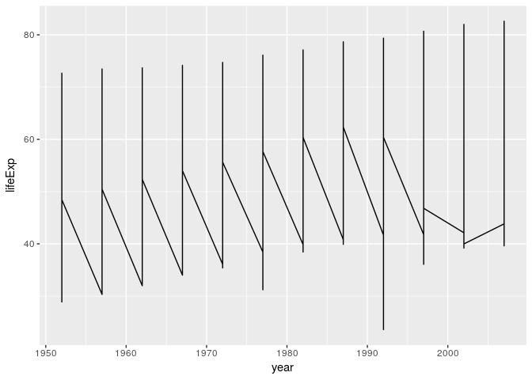

`aes` stands for *aesthetics*: Mappings between variables in our data and visual properties. Each column in our data frame is a variable. Visual properties are manifold and can be `x`, `y`, `colour`, `size`, `shape`, `alpha`, `fill`, `radius`, `linetype`, `group`...

We use the `aes()` function to map `x`-position to the variable `Time` and `y`-position to the variable `weight`. **Every time you map a variable to a visual property you do it inside `aes()`**

The plot looks strange. A single line is drawn across all data points. We want separate lines -- one time series per country...

``` r
ggplot(data = gapminder) +
  geom_line(aes(x = year, y = lifeExp, group = country))
```

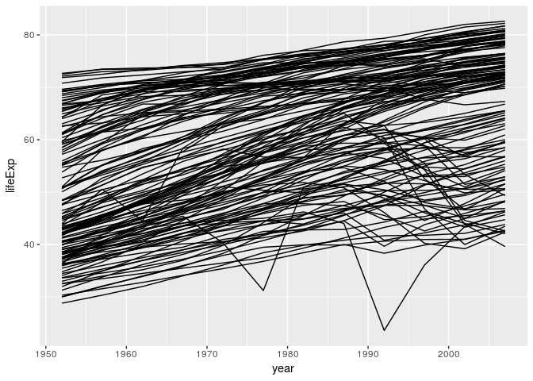

Note that we don't write `x = gapminder$year` or `y = "lifeExp"`. We simply spell out the name of the variable we wish to work with. ggplot is aware of the dataset we work with -- it is *attached*. Quoting the variable names would actually produce unexpected results:

``` r
ggplot(data = gapminder) +
  geom_line(aes(x = "year", y = "lifeExp", group = "country"))
```

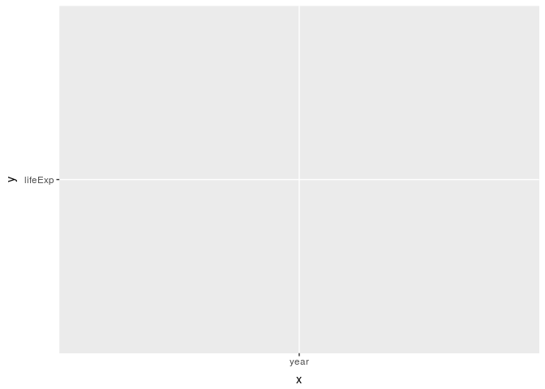

What happened? ggplot interpreted the quoted strings as raw data instead of variable names of our data frame. It then tries to plot it... **Always use unquoted column names to address the variables in your data.**

Let's colour all of the lines blue.

``` r
ggplot(data = gapminder) +
  geom_line(aes(x = year, y = lifeExp, group = country), colour = "blue")
```

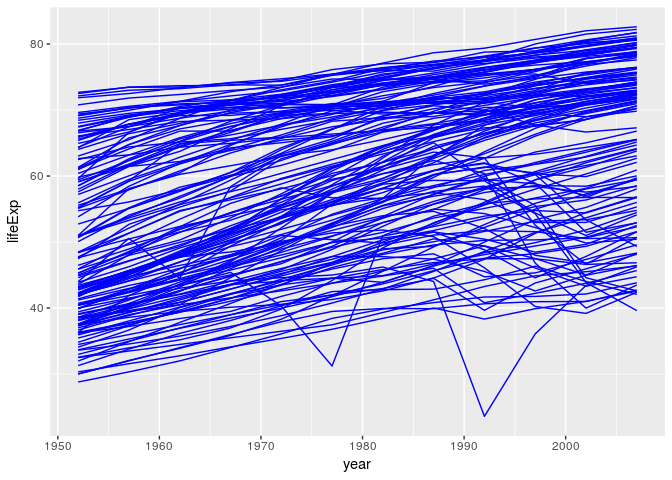

We wrote `colour = "blue"` outside of the `aes()` function as we *set* the visual property to a fixed value instead of *mapping* a visual property to a variable in the data frame. For comparison, let's move the colour specification into the `aes()` function:

``` r
ggplot(data = gapminder) +
  geom_line(aes(x = year, y = lifeExp, group = country, colour = "blue"))
```

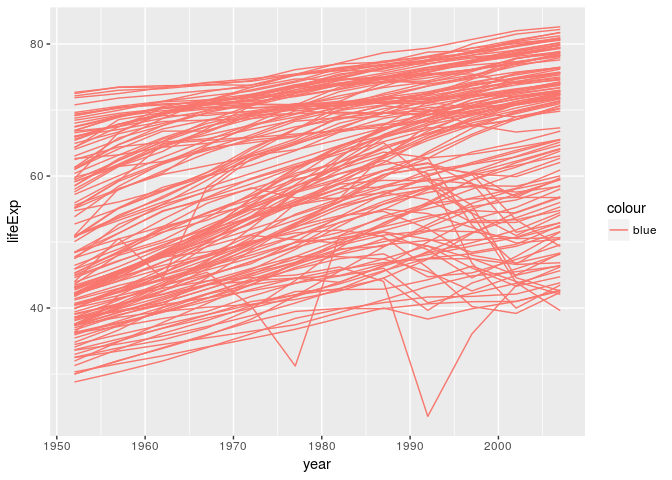

Classic ggplot moment here... "blue" gets interpreted as raw data as we have written it inside of the `aes()` function. ggplot thinks all of our rows belong to group "blue", mapped to the visual property colour. ggplot assigns a default colour scale of which the first colour is a light red. Here's the same behaviour, but this time it makes sense as we map colour to an actual variable in our data set.

``` r
ggplot(data = gapminder) +
  geom_line(aes(x = year, y = lifeExp, group = country, colour = continent))
```

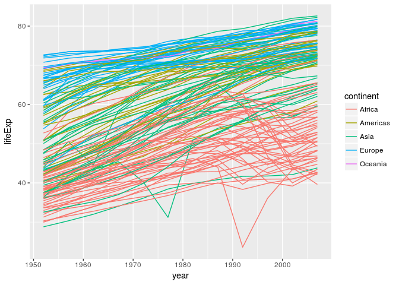

Lesson to be learned: The difference between *mapping* and *setting* a visual property. **You map visual properties to variables inside `aes()`, you set visual properties to a fixed value outside of `aes()`.**

We can add more than a single layer to a plot. ggplot 2.0.0 comes with 27 *geometries* (`geom`). Some of them are super straightforward and just draw points or lines or rectangles. Some draw complex shapes after transforming your data in various ways. **Think of geometries as flexible templates for different plot types.** Combining different geometries is a common workflow in ggplot. E.g. adding `geom_point` to `geom_line` gives lines with points on them:

``` r
# filter data to 4 countries only
gapminder_sub <-
  filter(gapminder,
         country %in% c("China", "Switzerland", "United States", "Somalia"))

ggplot(data = gapminder_sub) +
  geom_line(aes(x = year, y = lifeExp, color = country)) +
  geom_point(aes(x = year, y = lifeExp, color = country))
```


Note that we did not need to specify the `group` argument in the last ggplot call. The have mapped colour to country and therefore implicitly specified the grouping structure of our data. We use `group` only if ggplot fails to correctly guess the grouping. If we use identical mappings in our layers we can move them into the `ggplot()` function. **Everything inside the `ggplot()` function is passed down to all other plot elements.**

``` r
ggplot(data = gapminder_sub, aes(x = year, y = lifeExp, color = country)) +
  geom_line() +
  geom_point()
```

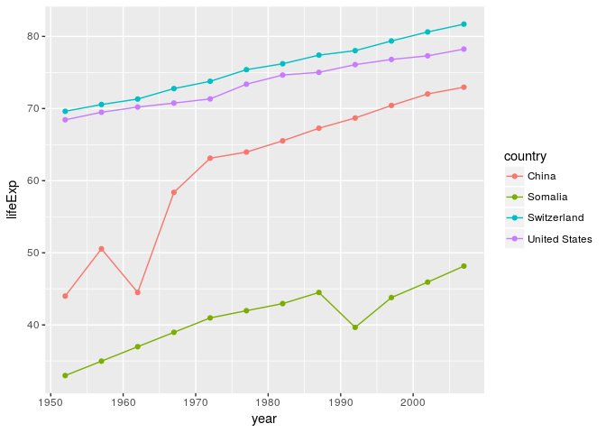

We can still add arguments to the individual layers.

``` r
ggplot(data = gapminder_sub, aes(x = year, y = lifeExp, color = country)) +
  geom_line(aes(linetype = country)) +
  geom_point(aes(shape = country))
```

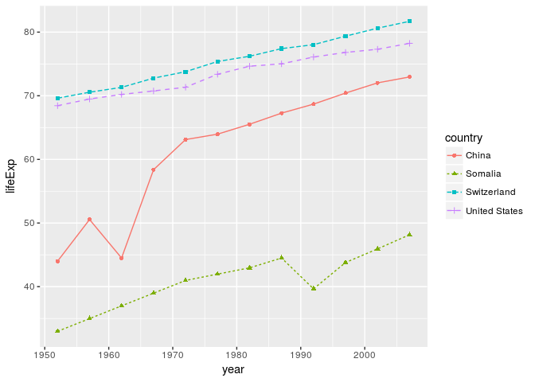

Unlike in real life, we also have the power to override commands from above:

``` r
ggplot(data = gapminder_sub, aes(x = year, y = lifeExp, color = country)) +
  geom_line(aes(linetype = country), colour = "black") +
  geom_point(aes(shape = country), colour = "black")
```

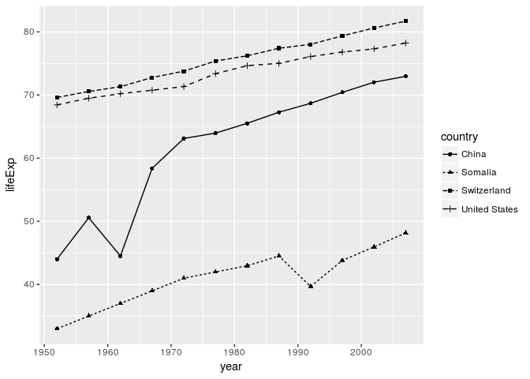

Scales (versus aesthetics)
--------------------------

We already know that *aesthetics* are mappings from data dimensions to visual properties. They tell ggplot what goes where. What are the aesthetics in **Gapminder World**?

| Data dimension      | Visual property                       | Scale            |
|:--------------------|:--------------------------------------|:-----------------|
| GDP per capita      | position on x-axis (`x`)              | `scale_x_*`      |
| Life expectancy     | position on y-axis (`y`)              | `scale_y_*`      |
| Population size     | size of plotting symbols (`size`)     | `scale_size_*`   |
| Geographical Region | colour of plotting symbols (`colour`) | `scale_colour_*` |

**Each aesthetic has its own scale**

The four aesthetics in *Gapminder World* are connected to four different scales. The scales are named after the corresponding aesthetic. The naming scheme is `scale_<name of aesthetic>_<continuous|discrete|specialized>`.

**Aesthetics specify the *what*, scales specify the *how***

Which colour to use for which level in the data? Where to put the labels on the axis? Which labels to put? The size of the largest plotting symbol, the name of the legends, log-transformation of the y-axis, the range of the axis... These are all examples of scale specifications -- specifications on *how* to map a data dimension to a visual attribute.

Off to work!

``` r
head(gapminder)
```

    ## # A tibble: 6 x 6
    ##       country continent  year lifeExp      pop gdpPercap
    ##        <fctr>    <fctr> <int>   <dbl>    <int>     <dbl>
    ## 1 Afghanistan      Asia  1952  28.801  8425333  779.4453
    ## 2 Afghanistan      Asia  1957  30.332  9240934  820.8530
    ## 3 Afghanistan      Asia  1962  31.997 10267083  853.1007
    ## 4 Afghanistan      Asia  1967  34.020 11537966  836.1971
    ## 5 Afghanistan      Asia  1972  36.088 13079460  739.9811
    ## 6 Afghanistan      Asia  1977  38.438 14880372  786.1134

The data already looks tidy. All we have to do is to subset to a single year. Let's see what ggplot produces if we simply specify the aesthetics to an appropriate geometry.

``` r
gapminder %>%
  filter(year == 2007) %>%
  ggplot(aes(x = gdpPercap, y = lifeExp, size = pop, colour = continent)) +
  geom_point()
```

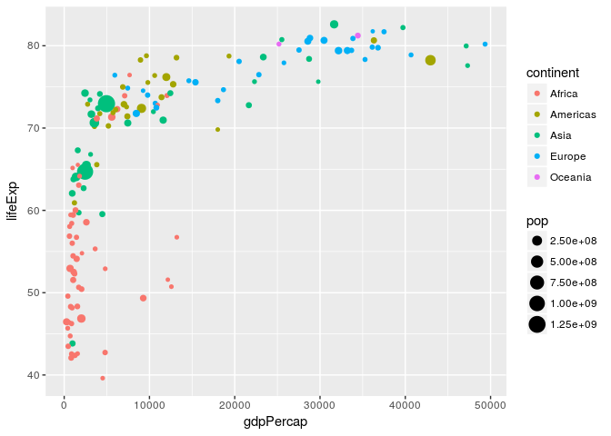

A solid foundation. But to close in on the *Gapminder World* chart we need to customize our scales.

**When changing scale attributes we have to make sure to make the changes on the appropriate scale**. Just ask yourself:

1.  What aesthetic does the scale correspond to? `scale_<name of aesthetic>_*`
2.  Am I dealing with a *discrete* or *continuous* variable? `scale_*_<continuous|discrete>` \#\#\# Scale names Once you know which scales to use, names are trivial to change.

``` r
gapminder %>% filter(year == 2007) %>%
  ggplot(aes(x = gdpPercap, y = lifeExp, size = pop, colour = continent)) +
  geom_point() +
  scale_x_continuous(name = "Income per person (GDP/capita, PPP$ inflation-adjusted)") +
  scale_y_continuous(name = "Life expectancy (years)") +
  scale_color_discrete(name = "Continent") +
  scale_size_continuous(name = "Population, total")
```

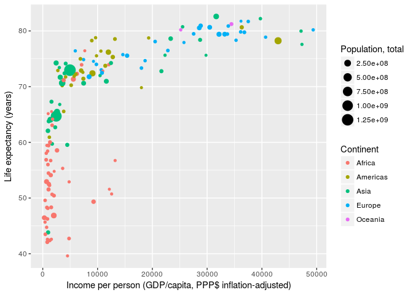

You can also use mathematical annotation in your scale names. For further information consult `?plotmath`.

``` r
gapminder %>% filter(year == 2007) %>%
  ggplot(aes(x = gdpPercap, y = lifeExp, size = pop, colour = continent)) +
  geom_point() +
  scale_x_continuous(name = expression(over(GDP, capita))) +
  scale_y_continuous(name = expression(e[0])) +
  scale_color_discrete(name = "Continent") +
  scale_size_continuous(name = "Population, total")
```

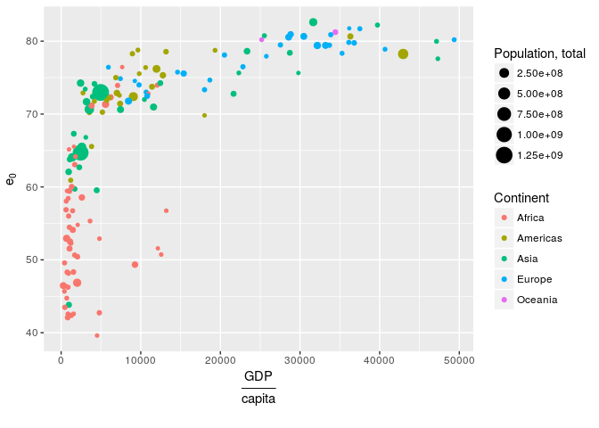

### Scale transformations

Next, we deal with *scale transformations*. In **Gapminder World** the x-axis is log-scaled meaning that the log of the x-axis data is taken before plotting. However, the labels remain on the linear scale. In that regard transforming scales is different from directly transforming the underlying data.

``` r
gapminder %>% filter(year == 2007) %>%
  ggplot(aes(x = gdpPercap, y = lifeExp, size = pop, colour = continent)) +
  geom_point() +
  scale_x_continuous(name = "Income per person (GDP/capita, PPP$ inflation-adjusted)",
                     trans = "log10") +
  scale_y_continuous(name = "Life expectancy (years)") +
  scale_color_discrete(name = "Continent") +
  scale_size_continuous(name = "Population, total")
```

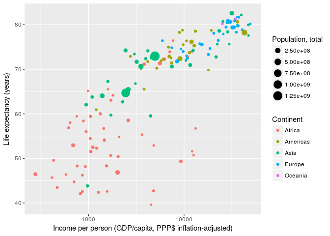

There are many different scale transformations built into ggplot. From the documentation:

> Built-in transformations include "asn", "atanh", "boxcox", "exp", "identity", "log", "log10", "log1p", "log2", "logit", "probability", "probit", "reciprocal", "reverse" and "sqrt".

``` r
gapminder %>% filter(year == 2007) %>%
  ggplot(aes(x = gdpPercap, y = lifeExp, size = pop, colour = continent)) +
  geom_point() +
  scale_x_continuous(name = "Income per person (GDP/capita, PPP$ inflation-adjusted)",
                     trans = "reverse") +
  scale_y_continuous(name = "Life expectancy (years)") +
  scale_color_discrete(name = "Continent") +
  scale_size_continuous(name = "Population, total")
```

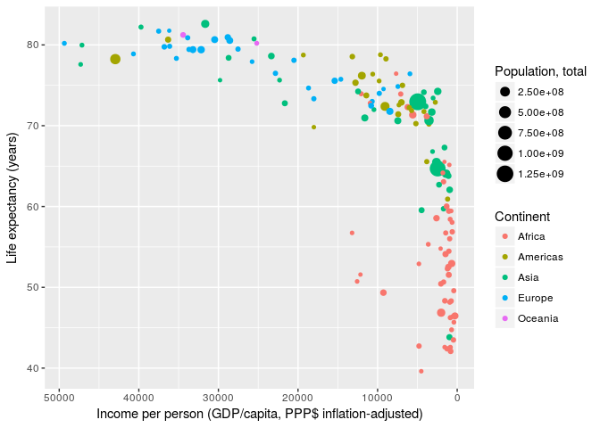

Note that the concept of scale transformations is not limited to position scales.

``` r
gapminder %>% filter(year == 2007) %>%
  ggplot(aes(x = gdpPercap, y = lifeExp, size = pop, colour = continent)) +
  geom_point() +
  scale_x_continuous(name = "Income per person (GDP/capita, PPP$ inflation-adjusted)",
                     trans = "log10") +
  scale_y_continuous(name = "Life expectancy (years)") +
  scale_color_discrete(name = "Continent") +
  scale_size_continuous(name = "Population, total", trans = "log10")
```

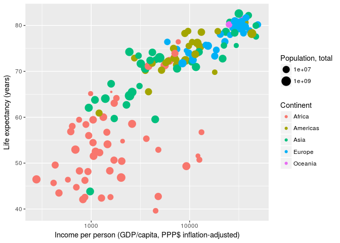

### Scale breaks and labels

Next, we manually specify the axis *breaks* and *labels* to be the same as in *Gapminder World*. Axis breaks are the positions where tick-marks and grid-lines are drawn. Labels specify what text to put at the breaks. **Breaks and labels have to be vectors of equal length.**

``` r
gapminder %>% filter(year == 2007) %>%
  ggplot(aes(x = gdpPercap, y = lifeExp, size = pop, colour = continent)) +
  geom_point() +
  scale_x_continuous(name = "Income per person (GDP/capita, PPP$ inflation-adjusted)",
                     trans = "log10",
                     breaks = c(200, 300, 400, 500,
                                600, 700, 800, 900,
                                1000, 2000, 3000, 4000, 5000,
                                6000, 7000, 8000, 9000,
                                10000, 20000, 30000, 40000, 50000,
                                60000, 70000, 80000, 90000),
                     labels = c("200", "", "400", "",
                                "", "", "", "",
                                "1000", "2000", "", "4000", "",
                                "", "", "", "",
                                "10000", "20000", "", "40000", "",
                                "", "", "", "")) +
  scale_y_continuous(name = "Life expectancy (years)",
                     breaks = c(25, 30, 35, 40, 45, 50,
                                55, 60, 65, 70, 75, 80, 85)) +
  scale_color_discrete(name  = "Continent") +
  scale_size_continuous(name = "Population, total")
```


OK, that was effective but clumsy. Luckily ggplot does not care *how* we generate the vector of breaks. We can use any R function as long as it outputs a vector. Even better, instead of manually spelling out the labels for each break we can write a short function that takes the breaks as input and formats them. Much nicer code -- same result.

``` r
gapminder %>% filter(year == 2007) %>%
  ggplot(aes(x = gdpPercap, y = lifeExp, size = pop, colour = continent)) +
  geom_point() +
  scale_x_continuous(name = "Income per person (GDP/capita, PPP$ inflation-adjusted)",
                     trans = "log10",
                     breaks = apply(expand.grid(1:9, 10^(2:4)), 1, FUN = prod)[-1],
                     labels = function(x) {ifelse(grepl("^[124]", x), x, "")}) +
  scale_y_continuous(name = "Life expectancy (years)",
                     breaks = seq(25, 85, 5)) +
  scale_color_discrete(name = "Continent") +
  scale_size_continuous(name = "Population, total")
```

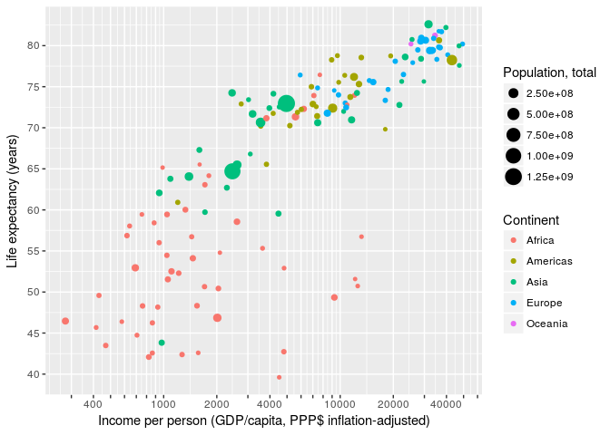

The concept of *breaks* and *labels* does not only apply to continuous axis. **All scales have breaks and labels**. E.g. on a colour scale the breaks are the colour keys, the labels are -- well -- the labels. **We reorder the items on our discrete scale by specifying the breaks in the required order.** We also use an R function to capitalize the labels.

``` r
gapminder %>% filter(year == 2007) %>%
  ggplot(aes(x = gdpPercap, y = lifeExp, size = pop, colour = continent)) +
  geom_point() +
  scale_x_continuous(name = "Income per person (GDP/capita, PPP$ inflation-adjusted)",
                     trans = "log10",
                     breaks = apply(expand.grid(1:9, 10^(2:4)), 1, FUN = prod)[-1],
                     labels = function(x) ifelse(grepl("^[124]", x), x, "")) +
  scale_y_continuous(name = "Life expectancy (years)",
                     breaks = seq(25, 85, 5)) +
  scale_color_discrete(name = "Continent",
                       breaks = c("Asia", "Africa", "Americas", "Europe", "Oceania"),
                       labels = toupper) +
  scale_size_continuous(name = "Population, total")
```

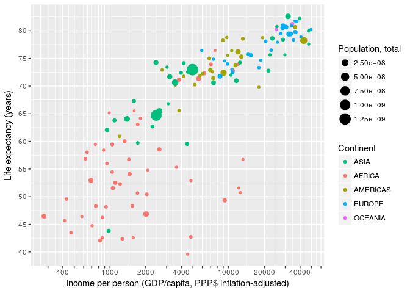

Finally, let's choose some sensible breaks and labels for the size scale.

``` r
gapminder %>% filter(year == 2007) %>%
  ggplot(aes(x = gdpPercap, y = lifeExp, size = pop, colour = continent)) +
  geom_point() +
  scale_x_continuous(name = "Income per person (GDP/capita, PPP$ inflation-adjusted)",
                     trans = "log10",
                     breaks = apply(expand.grid(1:9, 10^(2:4)), 1, FUN = prod)[-1],
                     labels = function(x) ifelse(grepl("^[124]", x), x, "")) +
  scale_y_continuous(name = "Life expectancy (years)",
                     breaks = seq(25, 85, 5)) +
  scale_color_discrete(name = "Continent",
                       breaks = c("Asia", "Africa", "Americas", "Europe", "Oceania"),
                       labels = toupper) +
  scale_size_continuous(name = "Population, total",
                        breaks = c(1E6, 10E6, 100E6, 1E9),
                        labels = function(x) format(x, big.mark = ",", scientific = FALSE))
```

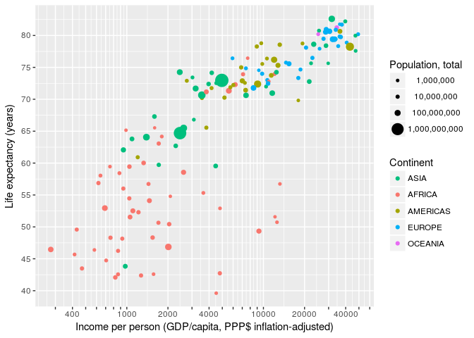

### Sidenote: levels and order in ggplot

It is easy to order items on a numerical scale. One just puts them on the number line. Usually low on the left and hight to the right. But what about discrete items? ggplot orders them according to the order of their factor levels. An example:

``` r
# test data
foo <- data.frame(id  = 1:4,
                  sex = c("Female", "Female", "Male", "Male"))
foo
```

    ##   id    sex
    ## 1  1 Female
    ## 2  2 Female
    ## 3  3   Male
    ## 4  4   Male

`data.frame`, just like ggplot, automatically converts a character vector to a factor using `as.factor`. The levels order of that factor follows the sequence of occurrence in the data.

``` r
levels(foo$sex)
```

    ## [1] "Female" "Male"

ggplot constructs discrete scales in the order of the levels of the underlying factor variable. Here, Females first, males after.

``` r
ggplot(foo) +
  geom_point(aes(x = sex, y = id, color = sex))
```


If we reverse the level order of the sex variable we change the way ggplot orders the discrete items.

``` r
foo$sex
```

    ## [1] Female Female Male   Male  
    ## Levels: Female Male

``` r
foo$sex <- factor(foo$sex, levels = c("Male", "Female"))
foo$sex
```

    ## [1] Female Female Male   Male  
    ## Levels: Male Female

Now we have males first and females last.

``` r
ggplot(foo) +
  geom_point(aes(x = sex, y = id, color = sex))
```

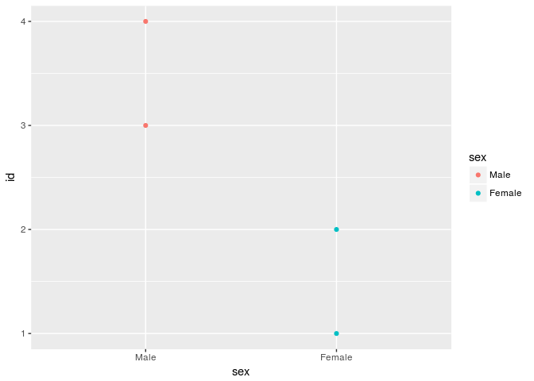

``` r
ggplot(foo) +
  geom_point(aes(x = sex, y = id, color = sex)) +
  facet_wrap(~sex)
```

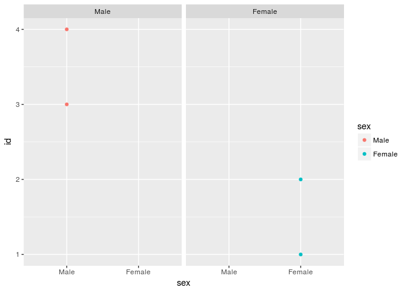

**NEVER OVERRIDE THE LEVELS DIRECTLY WHEN JUST MEANING TO CHANGE THE ORDER!** You'll screw up your data. In our case we just changed the sex of the participants.

``` r
foo$sex
```

    ## [1] Female Female Male   Male  
    ## Levels: Male Female

``` r
levels(foo$sex) <- c("Female", "Male")
foo$sex
```

    ## [1] Male   Male   Female Female
    ## Levels: Female Male

### Scale limits

We match the maximum and minimum value of our xy-scales with those of the *Gapminder World* chart by specifying the *limits* of the scales.

``` r
gapminder %>% filter(year == 2007) %>%
  ggplot(aes(x = gdpPercap, y = lifeExp, size = pop, colour = continent)) +
  geom_point() +
  scale_x_continuous(name = "Income per person (GDP/capita, PPP$ inflation-adjusted)",
                     trans = "log10",
                     breaks = apply(expand.grid(1:9, 10^(2:4)), 1, FUN = prod)[-1],
                     labels = function(x) ifelse(grepl("^[124]", x), x, ""),
                     limits = c(200, 90000)) +
  scale_y_continuous(name = "Life expectancy (years)",
                     breaks = seq(25, 85, 5),
                     limits = c(25, 85)) +
  scale_color_discrete(name = "Continent",
                       breaks = c("Asia", "Africa", "Americas", "Europe", "Oceania"),
                       labels = toupper) +
  scale_size_continuous(name = "Population, total",
                        breaks = c(1E6, 10E6, 100E6, 1E9),
                        labels = function(x) format(x, big.mark = ",", scientific = FALSE))
```

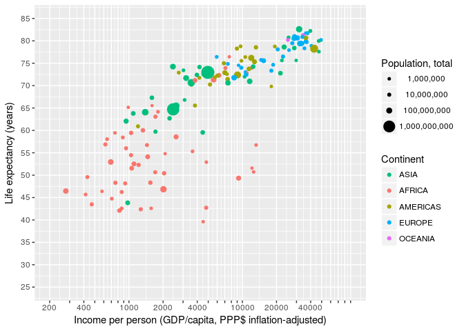

### Sidenote: Limiting versus zooming

Note that values outside of the limits will be discarded. This is of importance if you want to zoom into a plot. Here we "zoom" by changing the limits of the scales...

``` r
gapminder %>% filter(year == 2007) %>%
  ggplot(aes(x = gdpPercap, y = lifeExp)) +
  geom_point(size = 20) +
  scale_x_continuous(limits = c(5000, 20000)) +
  scale_y_continuous(limits = c(70, 80))
```

    ## Warning: Removed 104 rows containing missing values (geom_point).

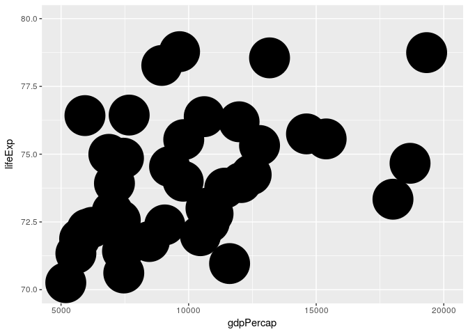

...and here we zoom by changing the limits of the coordinate system

``` r
gapminder %>% filter(year == 2007) %>%
  ggplot(aes(x = gdpPercap, y = lifeExp)) +
  geom_point(size = 20) +
  coord_cartesian(xlim = c(5000, 20000), ylim = c(70, 80))
```

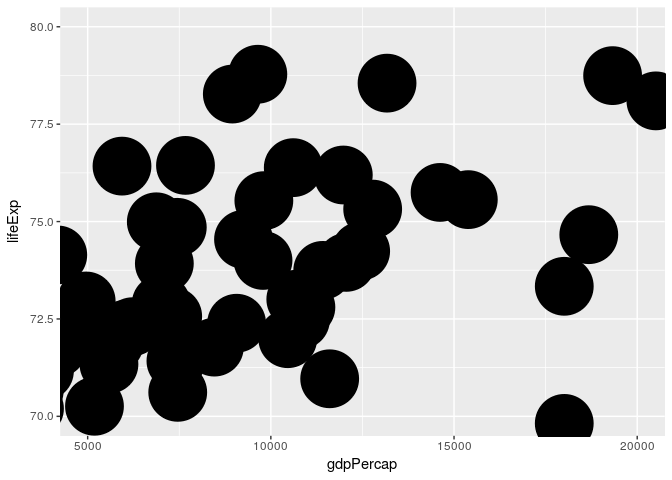

A makeover...
-------------

As always, something to chew on for the hypermotivated.

``` r
gapminder %>% filter(year == 2007) %>%
  ggplot(aes(x = gdpPercap, y = lifeExp, size = pop, fill = continent)) +
  annotate(geom = "text", x = 4000, y = 55, label = 2007,
           colour = "#D3E0E6", size = 50, fontface = "bold") +
  geom_point(colour = "black", shape = 21) +
  scale_x_continuous(name = "Income per person (GDP/capita, PPP$ inflation-adjusted)",
                     trans = "log10",
                     breaks = apply(expand.grid(1:9, 10^(2:4)), 1, FUN = prod)[-1],
                     labels = function(x) ifelse(grepl("^[124]", x), x, ""),
                     limits = c(200, 90000)) +
  scale_y_continuous(name = "Life expectancy (years)",
                     breaks = seq(25, 85, 5),
                     limits = c(25, 85)) +
  scale_fill_manual(name = "Continent",
                    breaks = c("Asia", "Africa", "Americas", "Europe", "Oceania"),
                    labels = toupper,
                    values = c("Asia" = "#2FFF7F",
                               "Africa" = "#FFFF2F",
                               "Americas" = "#FF2F2F",
                               "Europe" = "#3F4FFF",
                               "Oceania" = "white")) +
  scale_size_area(name = "Population, total", max_size = 20,
                  breaks = c(1E6, 10E6, 100E6, 1E9),
                  labels = function(x) format(x, big.mark = ",", scientific = FALSE)) +
  guides(fill = guide_legend(order = 1,
                             override.aes = list(shape = 22, size = 8))) +
  theme_bw() +
  theme(plot.background = element_rect(fill = "#CEDCE3"),
        text = element_text(colour = "#47576B"),
        axis.title = element_text(face = "bold"),
        legend.background = element_rect(fill = "#B5CBD5"),
        legend.key = element_blank())
```

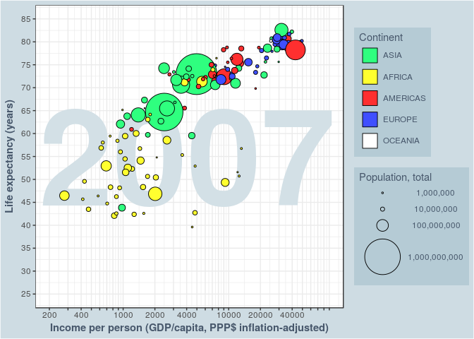

Further Reading
---------------

-   [A good place to start with ggplot.](http://r4ds.had.co.nz/data-visualisation.html)
-   [THE ggplot2 Cheat-Sheet](https://www.rstudio.com/wp-content/uploads/2016/11/ggplot2-cheatsheet-2.1.pdf). A handy reference sheet, not only compressing most of the `ggplot2` functionality into 2 pages, but also outlining the underlying logic.
-   [The ggplot documentation](http://ggplot2.tidyverse.org/reference/index.html) contains all the information about different scales and their options along with illustrated examples.
-   [How to do your bread and butter graphs in ggplot](http://www.cookbook-r.com/Graphs/)
-   [Elegant Graphics for Data Analysis](https://www.springer.com/us/book/9780387981406): The book by the author of `ggplot` himself is a good place to learn the general idea as well as the deeper functionalities of the library. yourself. All the source files are publicly available [here](https://github.com/hadley/ggplot2-book).
-   [The Grammar of Graphics](https://www.springer.com/us/book/9780387245447): `ggplot` is modelled after the framework for describing visualizations introduced in this book. If you are eager to learn where `ggplot` comes from, look here.

``` r
sessionInfo()
```

    ## R version 3.4.0 (2017-04-21)
    ## Platform: x86_64-pc-linux-gnu (64-bit)
    ## Running under: Ubuntu 16.04.2 LTS
    ## 
    ## Matrix products: default
    ## BLAS: /usr/lib/libblas/libblas.so.3.6.0
    ## LAPACK: /usr/lib/lapack/liblapack.so.3.6.0
    ## 
    ## locale:
    ##  [1] LC_CTYPE=en_US.UTF-8       LC_NUMERIC=C              
    ##  [3] LC_TIME=en_US.UTF-8        LC_COLLATE=en_US.UTF-8    
    ##  [5] LC_MONETARY=en_US.UTF-8    LC_MESSAGES=en_US.UTF-8   
    ##  [7] LC_PAPER=en_US.UTF-8       LC_NAME=C                 
    ##  [9] LC_ADDRESS=C               LC_TELEPHONE=C            
    ## [11] LC_MEASUREMENT=en_US.UTF-8 LC_IDENTIFICATION=C       
    ## 
    ## attached base packages:
    ## [1] stats     graphics  grDevices utils     datasets  methods   base     
    ## 
    ## other attached packages:
    ## [1] gapminder_0.2.0 dplyr_0.5.0     purrr_0.2.2.2   readr_1.1.1    
    ## [5] tidyr_0.6.3     tibble_1.3.3    ggplot2_2.2.1   tidyverse_1.1.1
    ## 
    ## loaded via a namespace (and not attached):
    ##  [1] Rcpp_0.12.11     cellranger_1.1.0 compiler_3.4.0   plyr_1.8.4      
    ##  [5] forcats_0.2.0    tools_3.4.0      digest_0.6.12    lubridate_1.6.0 
    ##  [9] jsonlite_1.4     evaluate_0.10    nlme_3.1-131     gtable_0.2.0    
    ## [13] lattice_0.20-35  rlang_0.1.1      psych_1.7.5      DBI_0.6-1       
    ## [17] yaml_2.1.14      parallel_3.4.0   haven_1.0.0      xml2_1.1.1      
    ## [21] httr_1.2.1       stringr_1.2.0    knitr_1.16       hms_0.3         
    ## [25] rprojroot_1.2    grid_3.4.0       R6_2.2.1         readxl_1.0.0    
    ## [29] foreign_0.8-67   rmarkdown_1.5    modelr_0.1.0     reshape2_1.4.2  
    ## [33] magrittr_1.5     backports_1.1.0  scales_0.4.1     htmltools_0.3.6 
    ## [37] rvest_0.3.2      assertthat_0.2.0 mnormt_1.5-5     colorspace_1.3-2
    ## [41] labeling_0.3     stringi_1.1.5    lazyeval_0.2.0   munsell_0.4.3   
    ## [45] broom_0.4.2

cc-by Jonas Schöley 2017
