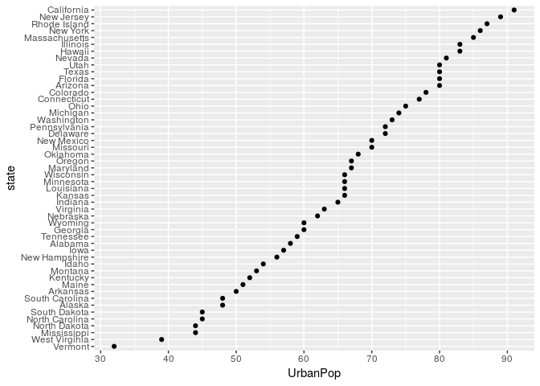
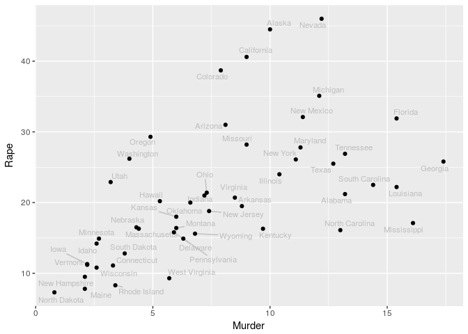
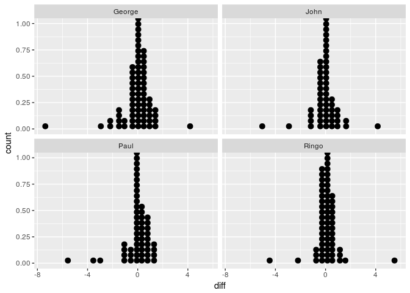
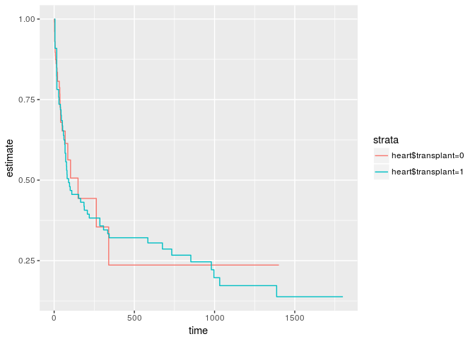

ggplot: Tidy data
================
Jonas Schöley
June 20th, 2017

-   [Every variable in its own column](#every-variable-in-its-own-column)
-   [Data Pipelines](#data-pipelines)
-   [Further examples](#further-examples)
    -   [Tidying data on police arrests](#tidying-data-on-police-arrests)
    -   [Tidying Anscombe's quartet](#tidying-anscombes-quartet)
    -   [Tidying data on test-retest reliability](#tidying-data-on-test-retest-reliability)
-   [Plotting model output](#plotting-model-output)
-   [Further Reading](#further-reading)

Every variable in its own column
--------------------------------

``` r
library(tidyverse)
```

    ## Loading tidyverse: ggplot2
    ## Loading tidyverse: tibble
    ## Loading tidyverse: tidyr
    ## Loading tidyverse: readr
    ## Loading tidyverse: purrr
    ## Loading tidyverse: dplyr

    ## Conflicts with tidy packages ----------------------------------------------

    ## filter(): dplyr, stats
    ## lag():    dplyr, stats

**Data structure matters a lot when working with ggplot**. However, once we provided ggplot with nice and tidy data it does a lot by itself. In order for this to work the data needs to be in the right format to begin with: **data needs to be a data frame** and **every variable of interest needs to be a separate column**. Let's explore what that means.

``` r
head(WorldPhones)
```

    ##      N.Amer Europe Asia S.Amer Oceania Africa Mid.Amer
    ## 1951  45939  21574 2876   1815    1646     89      555
    ## 1956  60423  29990 4708   2568    2366   1411      733
    ## 1957  64721  32510 5230   2695    2526   1546      773
    ## 1958  68484  35218 6662   2845    2691   1663      836
    ## 1959  71799  37598 6856   3000    2868   1769      911
    ## 1960  76036  40341 8220   3145    3054   1905     1008

Here's the number of telephone connections over time by continent. The first problem with this data is that it's not a *data frame*, it's a matrix with row and column names. If we try to plot it, well...

``` r
ggplot(WorldPhones)
```

    ## Error: ggplot2 doesn't know how to deal with data of class matrix

That's easily fixed however

``` r
phones <- as.data.frame(WorldPhones)
```

Say we we want to plot the number of telephone connections over time by continent. This implies the following *variables of interest*:

-   the number of telephone connections `n`
-   the continent `cont`
-   the year `year`

Problem is, *none* of these variables are explicitly given in our data frame. Of course the data is all there, just not in a format we can use with ggplot. Remember: all we handle in ggplot are names of variables which in turn are columns of a data frame. So the question is how to reshape the data into a form where all the variables of interest are separate columns in the data frame.

To reshape we are going to use the libraries [dplyr](https://cran.rstudio.com/web/packages/dplyr/vignettes/introduction.html) and [tidyr](https://cran.r-project.org/web/packages/tidyr/vignettes/tidy-data.html). Both are loaded when you load `library(tidyverse)`. The easiest variable to make explicit is the year. It is given as rownames of the data frame. We take the rownames, convert them from character to integer type, and add them as the variable `year` to the data frame.

``` r
phones <- mutate(phones, year = as.integer(rownames(phones)))
phones
```

    ##   N.Amer Europe Asia S.Amer Oceania Africa Mid.Amer year
    ## 1  45939  21574 2876   1815    1646     89      555 1951
    ## 2  60423  29990 4708   2568    2366   1411      733 1956
    ## 3  64721  32510 5230   2695    2526   1546      773 1957
    ## 4  68484  35218 6662   2845    2691   1663      836 1958
    ## 5  71799  37598 6856   3000    2868   1769      911 1959
    ## 6  76036  40341 8220   3145    3054   1905     1008 1960
    ## 7  79831  43173 9053   3338    3224   2005     1076 1961

That leaves us with the variables *"number of telephone connections"* and *"continent"* to make explicit. They shall become separate columns in the data frame. With the help of `gather()` we **transform from wide to long format**.

``` r
phones <- gather(phones, key = cont, value = n, -year)
phones
```

    ##    year     cont     n
    ## 1  1951   N.Amer 45939
    ## 2  1956   N.Amer 60423
    ## 3  1957   N.Amer 64721
    ## 4  1958   N.Amer 68484
    ## 5  1959   N.Amer 71799
    ## 6  1960   N.Amer 76036
    ## 7  1961   N.Amer 79831
    ## 8  1951   Europe 21574
    ## 9  1956   Europe 29990
    ## 10 1957   Europe 32510
    ## 11 1958   Europe 35218
    ## 12 1959   Europe 37598
    ## 13 1960   Europe 40341
    ## 14 1961   Europe 43173
    ## 15 1951     Asia  2876
    ## 16 1956     Asia  4708
    ## 17 1957     Asia  5230
    ## 18 1958     Asia  6662
    ## 19 1959     Asia  6856
    ## 20 1960     Asia  8220
    ## 21 1961     Asia  9053
    ## 22 1951   S.Amer  1815
    ## 23 1956   S.Amer  2568
    ## 24 1957   S.Amer  2695
    ## 25 1958   S.Amer  2845
    ## 26 1959   S.Amer  3000
    ## 27 1960   S.Amer  3145
    ## 28 1961   S.Amer  3338
    ## 29 1951  Oceania  1646
    ## 30 1956  Oceania  2366
    ## 31 1957  Oceania  2526
    ## 32 1958  Oceania  2691
    ## 33 1959  Oceania  2868
    ## 34 1960  Oceania  3054
    ## 35 1961  Oceania  3224
    ## 36 1951   Africa    89
    ## 37 1956   Africa  1411
    ## 38 1957   Africa  1546
    ## 39 1958   Africa  1663
    ## 40 1959   Africa  1769
    ## 41 1960   Africa  1905
    ## 42 1961   Africa  2005
    ## 43 1951 Mid.Amer   555
    ## 44 1956 Mid.Amer   733
    ## 45 1957 Mid.Amer   773
    ## 46 1958 Mid.Amer   836
    ## 47 1959 Mid.Amer   911
    ## 48 1960 Mid.Amer  1008
    ## 49 1961 Mid.Amer  1076

What kind of black magic did just happen? **A short primer on wide versus long data format**: Each table has a *wide format* and a long format representation. The information content is the same in both formats. It's the layout that differs.

Here's a wide format table containing the explicit variables `Female` and `Male`.

``` r
wide <- data_frame(Female = 1:2, Male = 3:4)
```

The same table in long format representation containing the explicit variables `Sex` and `N`.

``` r
gather(wide, key = Sex, value = N)
```

    ## # A tibble: 4 x 2
    ##      Sex     N
    ##    <chr> <int>
    ## 1 Female     1
    ## 2 Female     2
    ## 3   Male     3
    ## 4   Male     4

Back to our telephone example. We told the computer to look at all columns apart from `year` and transform them into the columns `cont` and `n`. `cont` holds the continent names for the variable `n`, the number of telephone connections. The continent names are taken from the original column names we *gathered* over.

We now can plot our data easily.

``` r
ggplot(phones) +
  geom_line(aes(x = year, y = n, colour = cont))
```


Data Pipelines
--------------

We can also write everything we did so far as a single *data analysis pipeline*. We start with the raw data and output a plot. This is a great approach for fast, interactive data analysis.

This is what we need to know in order to build pipelines:

-   The object on the left of the pipe operator (`%>%`) is passed onto the first argument of the function on the right
-   If we want to use the object on the left in other places than the first argument we can explicitly refer to it by using a dot (`.`)

Here's our telephone example in pipeline form.

``` r
# the raw data...
WorldPhones %>%
  # ...is converted to a data frame...
  as.data.frame() %>%
  # ...the rownames are added as the column `year`...
  # (note that I use the dot here to explicitly refer to the input data)
  mutate(year = as.integer(rownames(.))) %>%
  # ...the data gets transformed from wide to long format...
  gather(key = cont, value = n, -year) %>%
  # ...and finally plotted
  # (note that I can pipe the tidy data frame directly into ggplot)
  ggplot() +
  geom_line(aes(x = year, y = n, colour = cont))
```


Further examples
----------------

### Tidying data on police arrests

Before we start plotting we need to ask ourselves: *What do we need to do with our data in order to get the plot we want?* Here are some examples.

``` r
# we start with raw data...
USArrests %>%
  mutate(
    # ...and add the new variable `state` from the rownames...
    state = rownames(.),
    # ...we then reorder the levels of `state` according to the percentage of
    # people living in urban areas...
    state = reorder(state, UrbanPop)) %>%
  # ...and make a dotplot of the percentage of urban population by state...
  ggplot() +
  geom_point(aes(x = UrbanPop, y = state))
```



``` r
# we start with raw data...
USArrests %>%
  mutate(
    # ...and add the new variable `state` from the rownames...
    state = rownames(.),
    # ...we then reorder the levels of `state` according to the combined
    # murder, assault and crime rates...
    state = reorder(state, Murder+Assault+Rape)) %>%
  # ...we convert to long format, gathering "Assault", "Murder" and "Rape"
  # into "crime"...
  gather(key = crime, value = rate, -state, -UrbanPop) %>%
  # ...and make a dotplot of the crime-rate by crime and state
  ggplot() +
  geom_point(aes(x = rate, y = state, colour = crime))
```


``` r
library(ggrepel) # brilliant package for labelling points in a scatterplot
# we start with raw data...
USArrests %>%
  # ...and add the new variable `state` from the rownames...
  mutate(state = rownames(.)) %>%
  # ...andmake a labelled scatterplot of Murder versus Rape
  ggplot(aes(x = Murder, y = Rape)) +
  geom_text_repel(aes(label = state),
                  colour = "grey",
                  segment.color = "grey",
                  size = 3) +
  geom_point()
```



### Tidying Anscombe's quartet

Can you figure out what happens here? Try running the code yourself line by line.

``` r
anscombe %>%
  mutate(id = seq_along(x1)) %>%
  gather(... = -id) %>%
  separate(key, sep = 1, into = c("axis", "panel")) %>%
  spread(key = axis, value = value) %>%
  ggplot(aes(x = x, y = y)) +
  geom_smooth(method = "lm", se = FALSE) +
  geom_point() +
  facet_wrap(~panel)
```


### Tidying data on test-retest reliability

``` r
wide <- read_csv("https://raw.githubusercontent.com/jschoeley/idem_viz/master/ggplot_practical/03-tidy_data/wide_data.csv")
```

    ## Parsed with column specification:
    ## cols(
    ##   .default = col_double(),
    ##   name_rater1 = col_character(),
    ##   name_rater2 = col_character()
    ## )

    ## See spec(...) for full column specifications.

``` r
wide
```

    ## # A tibble: 48 x 20
    ##    name_rater1 area2d_camera1a area2d_camera1b area3d_camera1a
    ##          <chr>           <dbl>           <dbl>           <dbl>
    ##  1        John            2.03            2.08            2.51
    ##  2        Paul            0.30            0.42            0.51
    ##  3        John            4.24            4.46            5.53
    ##  4        John            2.87            3.08            4.03
    ##  5        John            5.60            5.83            8.13
    ##  6        Paul            8.09            7.99           12.81
    ##  7       Ringo            0.84            0.91            0.91
    ##  8       Ringo            1.05            1.03            1.20
    ##  9        John           30.96           31.50           48.62
    ## 10      George           21.61           21.96           29.99
    ## # ... with 38 more rows, and 16 more variables: area3d_camera1b <dbl>,
    ## #   volume_camera1a <dbl>, volume_camera1b <dbl>, volume_gel1 <dbl>,
    ## #   circum_camera1a <dbl>, circum_camera1b <dbl>, name_rater2 <chr>,
    ## #   area2d_camera2a <dbl>, area2d_camera2b <dbl>, area3d_camera2a <dbl>,
    ## #   area3d_camera2b <dbl>, volume_camera2a <dbl>, volume_camera2b <dbl>,
    ## #   volume_gel2 <dbl>, circum_camera2a <dbl>, circum_camera2b <dbl>

``` r
wide %>%
  # add a unique identifier to each row (each patient)
  mutate(id = 1:nrow(.)) %>%
  gather(key = type, value = value, -id, -name_rater1, -name_rater2) %>%
  separate(col = type, into = c("measurement", "method"), sep = "_") %>%
  mutate(rater = ifelse(grepl('1', method), name_rater1, name_rater2)) %>%
  separate(col = method, into = c("method", "test"), sep = "\\d") %>%
  mutate(test = ifelse(test == "", "a", test)) %>%
  # beautification
  select(id, rater, test, measurement, method, value) %>%
  arrange(id, measurement, rater, test) -> long

long %>%
  filter(method == "camera") %>%
  ggplot(aes(x = test, y = value)) +
  geom_line(aes(color= rater, group = id)) +
  facet_grid(rater~measurement)
```

    ## Warning: Removed 30 rows containing missing values (geom_path).


Comparisions along the y-axis is easiest if the scales are aligned therefore it is easier to compare along the horizontal.

``` r
long %>%
  filter(method == "camera") %>%
  ggplot(aes(x = test, y = value)) +
  geom_line(aes(color= rater, group = id)) +
  facet_grid(measurement~rater)
```

    ## Warning: Removed 54 rows containing missing values (geom_path).


Differences are seen most clearly when plotted directly.

``` r
long %>%
  filter(method == "camera") %>%
  spread(test, value = value) %>%
  mutate(diff = a-b) %>%
  ggplot() +
  geom_dotplot(aes(x = diff)) +
  facet_wrap(~rater)
```

    ## `stat_bindot()` using `bins = 30`. Pick better value with `binwidth`.

    ## Warning: Removed 39 rows containing non-finite values (stat_bindot).



Plotting model output
---------------------

We "tidy" the output of the `survfit` function via the "broom" package.

``` r
library(survival)
surv <- survfit(Surv(time = heart$start, time2 = heart$stop, event = heart$event) ~ heart$transplant)
surv
```

    ## Call: survfit(formula = Surv(time = heart$start, time2 = heart$stop, 
    ##     event = heart$event) ~ heart$transplant)
    ## 
    ##                    records n.max n.start events median 0.95LCL 0.95UCL
    ## heart$transplant=0     103   103       0     30    149      69      NA
    ## heart$transplant=1      69    45       0     45     90      53     334

``` r
broom::tidy(surv) %>%
  ggplot(aes(x = time, y = estimate)) +
  geom_step(aes(colour = strata))
```



Dobson (1990) Page 93: Randomized Controlled Trial.

``` r
dat <- data_frame(
  counts = c(18,17,15,20,10,20,25,13,12),
  outcome = gl(3,1,9),
  treatment = gl(3,3)
)

dat_fit <- glm(counts ~ outcome + treatment, family = poisson(), data = dat)

broom::tidy(dat_fit)
```

    ##          term      estimate std.error     statistic      p.value
    ## 1 (Intercept)  3.044522e+00 0.1708987  1.781478e+01 5.426767e-71
    ## 2    outcome2 -4.542553e-01 0.2021708 -2.246889e+00 2.464711e-02
    ## 3    outcome3 -2.929871e-01 0.1927423 -1.520097e+00 1.284865e-01
    ## 4  treatment2  1.337909e-15 0.2000000  6.689547e-15 1.000000e+00
    ## 5  treatment3  1.421085e-15 0.2000000  7.105427e-15 1.000000e+00

``` r
broom::glance(dat_fit)
```

    ##   null.deviance df.null    logLik      AIC      BIC deviance df.residual
    ## 1      10.58145       8 -23.38066 56.76132 57.74744 5.129141           4

Further Reading
---------------

-   [Tidy Data.](http://www.jstatsoft.org/v59/i10/paper) A lot of confusion about ggplot stems from the data being in an unsuitable format. ggplot works with what its creator calls *tidy data*.
-   [An introduction to data transformation with `dplyr`.](https://cran.rstudio.com/web/packages/dplyr/vignettes/introduction.html) This covers -- among other things -- data pipelines.
-   [An introduction to data tidying with `tidyr`.](https://cran.r-project.org/web/packages/tidyr/vignettes/tidy-data.html). This involves -- among other things -- transforming between long and wide format.
-   [The data wrangling cheat sheet](https://www.rstudio.com/wp-content/uploads/2015/02/data-wrangling-cheatsheet.pdf) is a great quick reference for `dplyr` and `tidyr`.

``` r
sessionInfo()
```

    ## R version 3.4.0 (2017-04-21)
    ## Platform: x86_64-pc-linux-gnu (64-bit)
    ## Running under: Ubuntu 16.04.2 LTS
    ## 
    ## Matrix products: default
    ## BLAS: /usr/lib/libblas/libblas.so.3.6.0
    ## LAPACK: /usr/lib/lapack/liblapack.so.3.6.0
    ## 
    ## locale:
    ##  [1] LC_CTYPE=en_US.UTF-8       LC_NUMERIC=C              
    ##  [3] LC_TIME=en_US.UTF-8        LC_COLLATE=en_US.UTF-8    
    ##  [5] LC_MONETARY=en_US.UTF-8    LC_MESSAGES=en_US.UTF-8   
    ##  [7] LC_PAPER=en_US.UTF-8       LC_NAME=C                 
    ##  [9] LC_ADDRESS=C               LC_TELEPHONE=C            
    ## [11] LC_MEASUREMENT=en_US.UTF-8 LC_IDENTIFICATION=C       
    ## 
    ## attached base packages:
    ## [1] stats     graphics  grDevices utils     datasets  methods   base     
    ## 
    ## other attached packages:
    ## [1] survival_2.41-3 ggrepel_0.6.5   dplyr_0.5.0     purrr_0.2.2.2  
    ## [5] readr_1.1.1     tidyr_0.6.3     tibble_1.3.3    ggplot2_2.2.1  
    ## [9] tidyverse_1.1.1
    ## 
    ## loaded via a namespace (and not attached):
    ##  [1] Rcpp_0.12.11     cellranger_1.1.0 compiler_3.4.0   plyr_1.8.4      
    ##  [5] forcats_0.2.0    tools_3.4.0      digest_0.6.12    lubridate_1.6.0 
    ##  [9] jsonlite_1.4     evaluate_0.10    nlme_3.1-131     gtable_0.2.0    
    ## [13] lattice_0.20-35  rlang_0.1.1      Matrix_1.2-10    psych_1.7.5     
    ## [17] DBI_0.6-1        curl_2.6         yaml_2.1.14      parallel_3.4.0  
    ## [21] haven_1.0.0      xml2_1.1.1       httr_1.2.1       stringr_1.2.0   
    ## [25] knitr_1.16       hms_0.3          rprojroot_1.2    grid_3.4.0      
    ## [29] R6_2.2.1         readxl_1.0.0     foreign_0.8-67   rmarkdown_1.5   
    ## [33] modelr_0.1.0     reshape2_1.4.2   magrittr_1.5     splines_3.4.0   
    ## [37] backports_1.1.0  scales_0.4.1     htmltools_0.3.6  rvest_0.3.2     
    ## [41] assertthat_0.2.0 mnormt_1.5-5     colorspace_1.3-2 labeling_0.3    
    ## [45] stringi_1.1.5    lazyeval_0.2.0   munsell_0.4.3    broom_0.4.2

cc-by Jonas Schöley 2017
