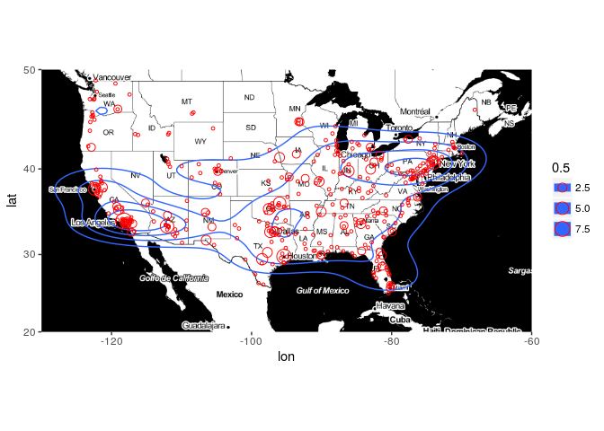
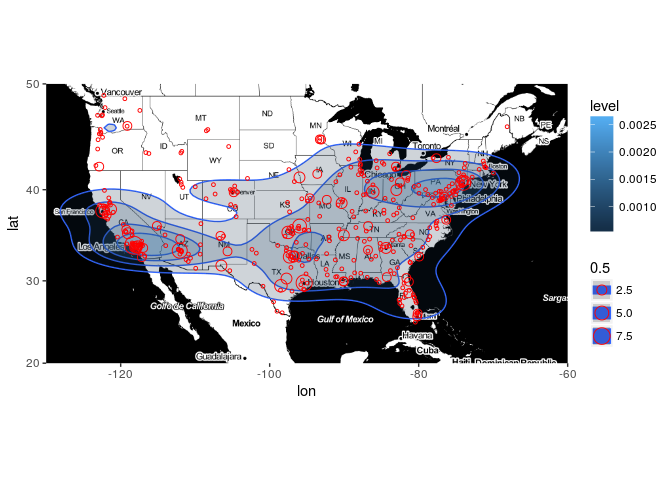
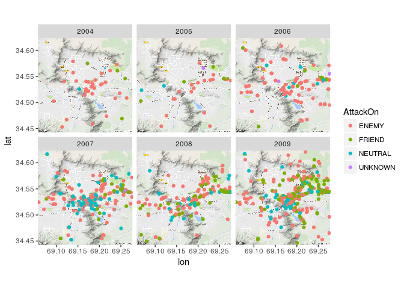

ggplot: Tile based maps
================
Jonas Schöley
June 22th, 2017

-   [Guardian: The Counted](#guardian-the-counted)
-   [Afghan War Diary](#afghan-war-diary)

``` r
library(tidyverse)
```

    ## Loading tidyverse: ggplot2
    ## Loading tidyverse: tibble
    ## Loading tidyverse: tidyr
    ## Loading tidyverse: readr
    ## Loading tidyverse: purrr
    ## Loading tidyverse: dplyr

    ## Conflicts with tidy packages ----------------------------------------------

    ## filter(): dplyr, stats
    ## lag():    dplyr, stats

``` r
library(ggmap)
```

Guardian: The Counted
---------------------

The British newspaper "The Guardian" assembled a database of people killed by police in the US in 2015. Source: <http://www.theguardian.com/thecounted> Read the data. Note that the strings should not be automatically converted to factor variables.

``` r
counted <- read_csv("the_counted.csv", na = "Unknown")
```

    ## Parsed with column specification:
    ## cols(
    ##   name = col_character(),
    ##   age = col_integer(),
    ##   gender = col_character(),
    ##   raceethnicity = col_character(),
    ##   month = col_character(),
    ##   day = col_integer(),
    ##   year = col_integer(),
    ##   streetaddress = col_character(),
    ##   city = col_character(),
    ##   state = col_character(),
    ##   cause = col_character(),
    ##   lawenforcementagency = col_character(),
    ##   armed = col_character()
    ## )

``` r
head(counted)
```

    ## # A tibble: 6 x 13
    ##                name   age gender   raceethnicity   month   day  year
    ##               <chr> <int>  <chr>           <chr>   <chr> <int> <int>
    ## 1   Roberto Ornelas    18   Male Hispanic/Latino January     1  2015
    ## 2   Matthew Ajibade    22   Male           Black January     1  2015
    ## 3     Garrett Gagne    22   Male           White January     1  2015
    ## 4      Lewis Lembke    47   Male           White January     2  2015
    ## 5 Michael Kocher Jr    19   Male           White January     3  2015
    ## 6     John Quintero    23   Male Hispanic/Latino January     3  2015
    ## # ... with 6 more variables: streetaddress <chr>, city <chr>, state <chr>,
    ## #   cause <chr>, lawenforcementagency <chr>, armed <chr>

Use Google Maps API to get latitude and longitude for each of the places in the dataset. This is completely automated, but takes some time and is limited by Google to 2500 map requests per day per IP. The `geocode` function is part of the `ggmap` package.

``` r
# killed <-
#   counted %>%
#   mutate(citystate = paste(city, state)) %>%
#   bind_cols(., geocode(.$citystate))
load("killed.Rdata")
```

Download a map of the US along with geographical coordinates. Note that this is not a shapefile but a raster image in Mercator map projection with longitude and latitude information. It is readily formatted for usage with `ggmap`.

``` r
usmap <- get_map(location = c(-130, 20, -60, 50),
                 maptype = "toner")
```

    ## maptype = "toner" is only available with source = "stamen".

    ## resetting to source = "stamen"...

    ## Map from URL : http://tile.stamen.com/toner/4/2/5.png

    ## Map from URL : http://tile.stamen.com/toner/4/3/5.png

    ## Map from URL : http://tile.stamen.com/toner/4/4/5.png

    ## Map from URL : http://tile.stamen.com/toner/4/5/5.png

    ## Map from URL : http://tile.stamen.com/toner/4/2/6.png

    ## Map from URL : http://tile.stamen.com/toner/4/3/6.png

    ## Map from URL : http://tile.stamen.com/toner/4/4/6.png

    ## Map from URL : http://tile.stamen.com/toner/4/5/6.png

    ## Map from URL : http://tile.stamen.com/toner/4/2/7.png

    ## Map from URL : http://tile.stamen.com/toner/4/3/7.png

    ## Map from URL : http://tile.stamen.com/toner/4/4/7.png

    ## Map from URL : http://tile.stamen.com/toner/4/5/7.png

A dot-density map of killed persons located by longitude and latitude. Instead of `ggplot` + `data` we use the `ggmap` command and supply it with our mapdata produced by `get_map`. The rest standard `ggplot` and we can use add ggplot geoms as usual. The only difference is that we must pass the data we want to display on the map as an extra `data` argument to the individual geoms.

``` r
ggmap(usmap) +
  geom_point(data = killed,
             aes(x = lon, y = lat),
             colour = "red")
```

    ## Warning: Removed 6 rows containing missing values (geom_point).


We can sum up cases at the same position and map the summed value to the size aestetic. `..n..` is a variable produced by the `sum` statistic and gives the number of cases at each `lon` and `lat`.

``` r
ggmap(usmap) +
  geom_point(data = killed,
             aes(x = lon, y = lat, size = ..n..),
             stat = "sum",
             colour = "red", shape = 1)
```

    ## Warning: Removed 6 rows containing non-finite values (stat_sum).


We overlay 2d density contours...

``` r
ggmap(usmap) +
  geom_density2d(data = killed,
                 aes(x = lon, y = lat),
                 bins = 5) +
  geom_point(data = killed,
             aes(x = lon, y = lat, size = ..n..),
             stat = "sum",
             colour = "red", shape = 1)
```

    ## Warning: Removed 6 rows containing non-finite values (stat_density2d).

    ## Warning: Removed 6 rows containing non-finite values (stat_sum).



...and shade them according to level.

``` r
ggmap(usmap) +
  geom_density2d(data = killed,
                 aes(x = lon, y = lat),
                 bins = 5) +
  geom_polygon(data = killed,
               aes(x = lon, y = lat, fill = ..level..),
               stat = "density2d",
               bins = 5,
               alpha = 0.2) +
  geom_point(data = killed,
             aes(x = lon, y = lat, size = ..n..),
             stat = "sum",
             colour = "red", shape = 1)
```

    ## Warning: Removed 6 rows containing non-finite values (stat_density2d).

    ## Warning: Removed 6 rows containing non-finite values (stat_density2d).

    ## Warning: Removed 6 rows containing non-finite values (stat_sum).



Note that this is not a very informative visualization as we have basically just reproduced population density. Dot maps are much more useful on a smaller scale, e.g. neighbourhoods or cities.

Afghan War Diary
----------------

``` r
afg <-
  read_csv("afg_war_diary.csv") %>%
  mutate(date = parse_datetime(DateOccurred, format = "%d/%m/%Y %H:%M"),
         year = lubridate::year(date))
```

    ## Parsed with column specification:
    ## cols(
    ##   DateOccurred = col_character(),
    ##   Type = col_character(),
    ##   Category = col_character(),
    ##   AttackOn = col_character(),
    ##   TypeOfUnit = col_character(),
    ##   FriendlyWIA = col_integer(),
    ##   FriendlyKIA = col_integer(),
    ##   HostNationWIA = col_integer(),
    ##   HostNationKIA = col_integer(),
    ##   CivilianWIA = col_integer(),
    ##   CivilianKIA = col_integer(),
    ##   EnemyWIA = col_integer(),
    ##   EnemyKIA = col_integer(),
    ##   EnemyDetained = col_integer(),
    ##   Latitude = col_double(),
    ##   Longitude = col_double(),
    ##   Affiliation = col_character()
    ## )

``` r
kabul <- get_map(location = c(69.166667, 34.533333), zoom = 12)
```

    ## Map from URL : http://maps.googleapis.com/maps/api/staticmap?center=34.533333,69.166667&zoom=12&size=640x640&scale=2&maptype=terrain&language=en-EN&sensor=false

``` r
ggmap(kabul) +
  geom_point(data = afg,
             aes(x = Longitude, y = Latitude, color = AttackOn))
```

    ## Warning: Removed 75069 rows containing missing values (geom_point).


``` r
ggmap(kabul) +
  geom_point(data = afg,
             aes(x = Longitude, y = Latitude, color = AttackOn)) +
  facet_wrap(~year)
```

    ## Warning: Removed 75069 rows containing missing values (geom_point).


